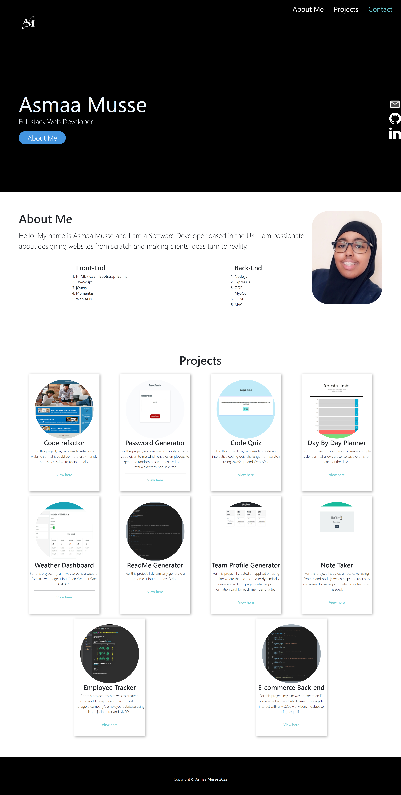

# Personal Portfolio 

## Overview

For this project my aim was to build my personal portfolio from scratch using HTML and advanced CSS.

## Table of contents:
- [Links](#links)
- [Technologies Used](#technologies-used)
- [Screenshot](#screenshot)
- [Contribute](#contribute)

## Links

Deployed Link: https://asmaamusse.github.io/personal-portfolio/

GitHub page: https://github.com/AsmaaMusse/personal-portfolio/tree/dev

### Technologies used:

- HTML
- CSS
- JavaScript

## Screenshot:

## Contribute

To contribute or ask questions, please <a href="https://mail.google.com/mail/u/0/?tf=cm&to=asmaamusse03@gmail.com&cc&bcc&su&body&fs=1">Email</a> here
